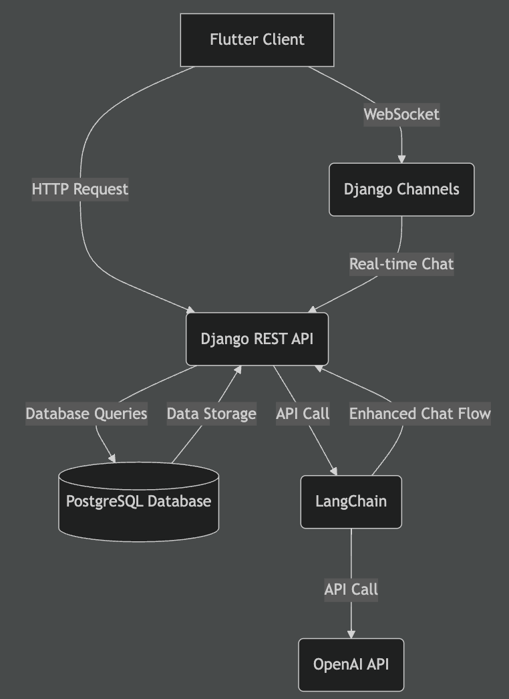

# LinguaScene - Roleplaying Chat Backend

`해당 프로젝트는 현재 진행중인 프로젝트 입니다.`

LinguaScene은 AI를 활용하여 사용자가 언어를 연습할 수 있는 롤플레잉 채팅 애플리케이션입니다. 이 백엔드 프로젝트는 Django, Django Rest Framework, Django Channels, LangChain, OpenAI API 등의 기술을 사용하여 구현되었으며, 사용자가 실시간으로 AI와 대화할 수 있는 환경을 제공합니다.

## **목차**

- [프로젝트 소개](#프로젝트-소개)
- [주요 기능](#주요-기능)
- [기술 스택](#기술-스택)
- [설치 및 실행](#설치-및-실행)
- [시스템 아키텍처](#시스템-아키텍처)
- [사용 예시](#사용-예시)
- [기여 방법](#기여-방법)
- [라이선스](#라이선스)

## 프로젝트 소개

**LinguaScene**은 사용자가 원하는 언어, 레벨, 그리고 다양한 상황을 입력 또는 선택하여 AI와 채팅을 통해 언어를 연습할 수 있도록 설계된 언어 학습 애플리케이션입니다. 이 프로젝트의 백엔드 시스템은 Django와 AI 기술을 활용한 채팅 서비스를 제공합니다.

## 주요 기능

### 사용자 관리

- **회원가입/로그인/로그아웃**: 이메일 및 비밀번호를 기반으로 회원 가입 및 로그인 지원
- **사용자 정보 관리**: 사용자 정보 조회 및 업데이트 기능 (추후 추가 예정)

### 채팅 기능

- **채팅방 관리**: 사용자가 채팅방을 생성, 삭제 및 업데이트할 수 있음
- **실시간 채팅**: WebSocket을 통한 AI와의 실시간 채팅 지원
- **메시지 추천**: AI를 통한 자연스러운 표현 추천 기능 (추후 추가 예정)

### 확장 기능

- **프롬프트 퀄리티 관리**: LangChain을 활용하여 AI 모델의 대화 흐름 개선
- **소셜 로그인**: 소셜 미디어 계정 연동 기능 지원 (추후 추가 예정)
- **음성 기능**: 음성 출력 및 입력 기능 추가 예정

## 기술 스택

- **Backend**: Django, Django Rest Framework, Django Channels
- **Database**: PostgreSQL
- **AI Integration**: LangChain, OpenAI API
- **Deployment**: Docker, AWS(구축 예정)
- **Frontend**: Flutter (별도 클라이언트 프로젝트에서 관리)

## 설치 및 실행

### **사전 요구사항**

- Docker 및 Docker Compose
- Python 3.11.5 이상
- Django 5.1 이상
- Django Restframework 3.15.2 이상
- Django Channels 4.1.0 이상
- PostgreSQL

### **1. 프로젝트 클론**

```bash
git clone https://github.com/sora9z/LinguaScene.git
cd backend
```

### **2. Docker 실행**

```bash
docker-compose up -d
```

### 3. **패키지 설치**

```bash
pip install -r requirements.txt
```

### 4. **데이터베이스 마이그레이션**

```bash
python manage.py migrate
```

### 5. **서버 실행**

```bash
python manage.py runserver
```

## 설치 및 실행

전체 시스템 구성
아래 다이어그램은 LinguaScene의 시스템 구성 요소와 이들 간의 상호 작용을 보여줍니다.



- Flutter Client: 사용자 인터페이스를 제공하고 Django REST API 및 Django Channels와 통신합니다.
- Django REST API: 애플리케이션의 백엔드 로직을 처리하며 데이터 저장 및 AI 연동을 담당합니다.
- Django Channels: WebSocket을 사용하여 실시간 채팅 기능을 제공합니다.
- PostgreSQL Database: 사용자, 채팅방, 메시지 등의 데이터를 저장합니다.
- LangChain: 대화의 자연스러움을 유지하고 향상시키는 AI 관리 모듈입니다.
- OpenAI API: 실제 AI 응답을 생성하는 외부 서비스입니다.

## 사용 예시

- 이메일과 페스워드로 회원가입을 합니다.
- 사용자는 애플리케이션에 로그인한 후, 채팅방을 생성합니다.
- 연습하고자 하는 언어와 레벨을 선택하고, 시나리오와 역할을 설정합니다.
- 생성된 채팅방에서 실시간으로 AI와 대화를 시작합니다.
- AI는 사용자의 입력에 따라 적절한 응답을 제공합니다.
